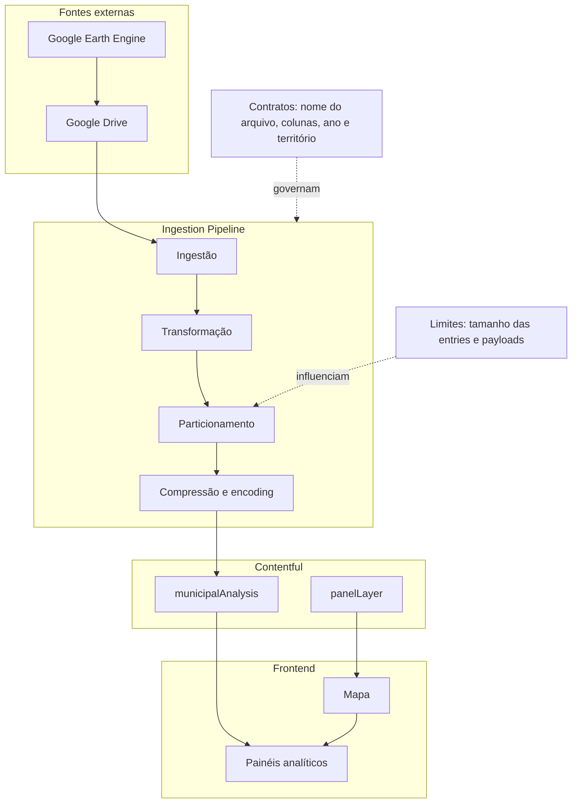

# Ingestion Pipeline

## Visão Geral

A pipeline transforma CSVs exportados do Google Earth Engine em entries
`municipalAnalysis` no Contentful, permitindo que o frontend consuma
dados já normalizados e particionados.

## Arquitetura

## Responsabilidades

### Ingestão

- Ler CSVs exportados do Google Earth Engine via Google Drive

### Transformação

- Normalizar os dados
- Associar cada dataset a um panelLayerId

### Particionamento

- Dividir payloads grandes em partes menores

### Publicação

- Criar, atualizar e publicar entries municipalAnalysis

## Dependências

- Google Earth Engine
- Google Drive API
- Contentful GraphQL API
- Contentful Management API

## Limitações

- Dependência de convenções de nomes de arquivos
- Dependência de colunas específicas nos CSVs
- Limites de tamanho do Contentful
- Não cria ou gerencia assets panelLayer
